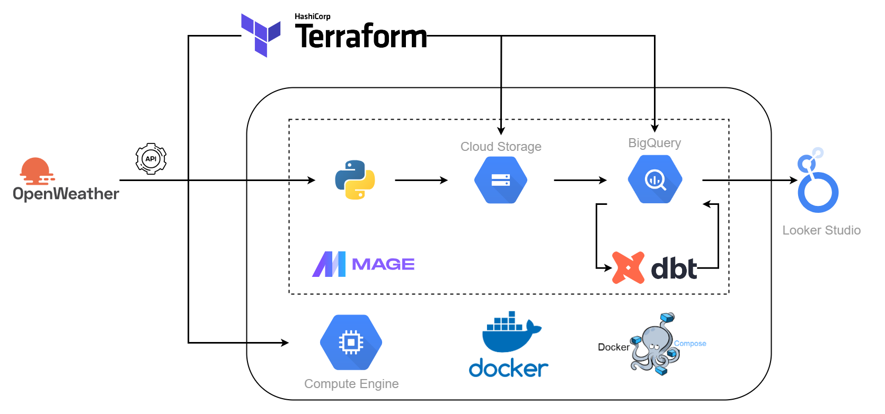

# air_pollution_tracking

A data pipeline with Mage, dbt, Docker, Terraform, GCP and much more!

## Description

### Problem

All around the world, especially in Germany, the issue of urban air pollution is a serious concern. However, the common citizen may find it difficult to get and understand air quality statistics. That's the role that my side project plays. It addresses this problem by loading and processing data on air pollution of the 80 biggest German cities from OpenWeather API. By utilizing an easy-to-use dashboard, users can monitor and visualize air quality measurements, enabling them to make informed decisions about their surroundings and health. This project intends to promote proactive efforts towards cleaner, healthier cities and increase public awareness of air pollution by making insights easily accessible.

### Objective

The project will create a batch data pipeline that processes the air pollution data. The data is retrieved from [OpenWeather API](https://openweathermap.org/api) based on the [list of cities](mage/germany_city.csv) with their latitude and longitude. The data would be processed daily and stored to the data lake. Then the pipeline will consume this data, apply transformations, and create the desired tables for our dashboard to generate analytics.

### Dataset

The air pollution data obtained from the [OpenWeather API](https://openweathermap.org/api) provides valuable insights into the quality of the air in different locations. This dataset typically includes information on various air pollutants such as particulate matter (PM2.5 and PM10), nitrogen monoxide (NO), nitrogen dioxide (NO2), sulfur dioxide (SO2), Ammonia (NH3), carbon monoxide (CO), and ozone (O3). The data may be available in real-time or historical formats, allowing for the analysis of air pollution trends over time. 

### Tools & Technologies

- Cloud - [**Google Cloud Platform**](https://cloud.google.com)
- Infrastructure as Code software - [**Terraform**](https://www.terraform.io)
- Containerization - [**Docker**](https://www.docker.com), [**Docker Compose**](https://docs.docker.com/compose/)
- Orchestration - [**Mage**](https://www.mage.ai/)
- Batch Processing - [**Python**](https://www.python.org)
- Transformation - [**dbt**](https://www.getdbt.com)
- Data Lake - [**Google Cloud Storage**](https://cloud.google.com/storage)
- Data Warehouse - [**BigQuery**](https://cloud.google.com/bigquery)
- Data Visualization - [**Looker Studio**](https://lookerstudio.google.com/overview)
- Language - [**Python**](https://www.python.org)

### Architecture

### Final Result

[Link to the dashboard](https://lookerstudio.google.com/s/jOxSt_QiToY)

## Setup

**WARNING: You will be charged for all the infra setup. You can avail 300$ in credit by creating a new account on GCP.**
### Pre-requisites

If you already have a Google Cloud account and a working terraform setup, you can skip the pre-requisite steps.

- Google Cloud Platform: [GCP Account and Access Setup](setup/gcp.md)
- Terraform: [Setup Terraform](https://github.com/DataTalksClub/data-engineering-zoomcamp/blob/main/week_1_basics_n_setup/1_terraform_gcp/windows.md#terraform)

### Get Going

- Procure infrastructure on GCP with Terraform - [Setup](setup/terraform.md)
- SSH into your Virtual Machine - [Setup](setup/ssh.md)
- Setup Mage on Virtual Machine to trigger the daily data pipeline - [Setup](setup/mage.md)

### Further Improvement

- Build dimensions and facts incrementally instead of full refresh
- Write data quality tests
- Create dimensional models for additional analysis
- Include CI/CD
- Add more visualizations

### Special Mentions
I'd like to thank the [DataTalks.Club](https://datatalks.club) for offering this Data Engineering course for completely free. All the things I learnt there, enabled me to come up with this project. If you want to develop skill on Data Engineering technologies, please check out the [course](https://github.com/DataTalksClub/data-engineering-zoomcamp).