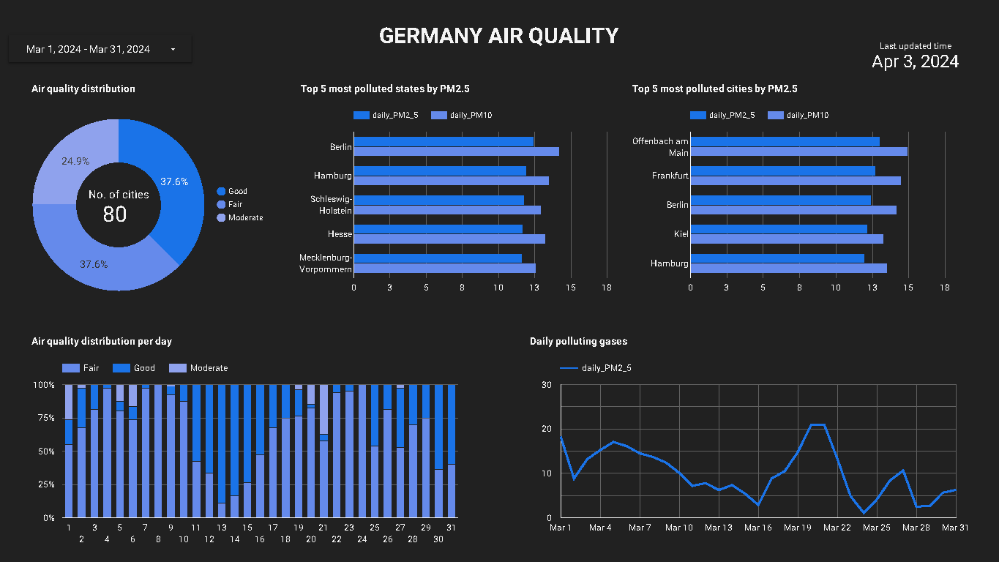

## Setup Mage VM

We will setup Mage on docker in a dedicated compute instance. dbt is setup inside Mage.

- Establish SSH connection
 
  ```bash
  ssh germany-air-quality-instance
  ```
- Clone git repo

  ```bash
  git clone https://github.com/voduyquoc/air_pollution_tracking.git && \
  cd air_pollution_tracking
  ```
- Install anaconda, docker & docker-compose.

  ```bash
  bash ~/air_pollution_tracking/setup/vm_setup.sh && \
  exec newgrp docker
  ```
- Move the service account json file from local to the VM machine in `~/.gc/` directory.  Make sure it is named as `google_credentials.json`  else the dags will fail!

  - You can use [sftp](https://youtu.be/ae-CV2KfoN0?t=2442) to transfer the file.

- cd into the Mage directory
  ```bash
  cd air_pollution_tracking/mage
  ```
- Update `your-open-weather-api-key` (create a free account on [OpenWeather](https://openweathermap.org/) website to have an free API key) and `your-gcs-bucket-name` in the file `dev.env`
  ```env
  PROJECT_NAME=air-pollution-tracking
  POSTGRES_DBNAME=postgres
  POSTGRES_SCHEMA=magic
  POSTGRES_USER=postgres
  POSTGRES_PASSWORD=postgres
  POSTGRES_HOST=postgres
  POSTGRES_PORT=5432
  API_KEY=your-open-weather-api-key
  BUCKET_NAME=your-gcs-bucket-name
  ```

- Rename `dev.env` to simply `.env` — this will ensure the file is not committed to Git by accident, since it will contain credentials in the future.

- cd into the dbt directory
  ```bash
  cd ~/air_pollution_tracking/mage/air-pollution-tracking/dbt/historical_air_pollution
  ```
- Update your `gcp-project-id` in the `profiles.yml` file
  ```yaml
  historical_air_pollution:
    outputs:
      prod:
        dataset: prod
        fixed_retries: 1
        keyfile: /home/src/google_credentials.json
        location: US
        method: service-account
        priority: interactive
        project: <gcp-project-id>
        threads: 4
        timeout_seconds: 300
        type: bigquery
    target: prod
  ```

- cd into the staging models in dbt directory
  ```bash
  cd ~/air_pollution_tracking/mage/air-pollution-tracking/dbt/historical_air_pollution/models/staging
  ```
- Update your `gcp-project-id` in the `schema.yml` file
  ```yaml
  sources:
    - name: staging
      database: <gcp-project-id>
      schema: air_pollution
  ```
- cd into the Mage directory again
  ```bash
  cd ~/air_pollution_tracking/mage
  ```
- Now, let's build the container
  ```bash
  docker-compose build
  ```
- Start the Docker container in detached mode:
  ```bash
  docker-compose up -d
  ```
- Run pipeline in Mage. (This shall take a few good minutes!)
  ```bash
  python trigger.py
  ```
- Mage should be available on port `6789` a couple of minutes after the above setup is complete.

- Airflow will be running in detached mode. To see the logs from docker run the below command

  ```bash
  docker-compose --follow
  ```

- To stop Mage

  ```bash
  docker-compose down
  ```

### Pipelines
- DAG Flow -
  - We first load data from OpenWeather API
  - We then transform data then upload the resulted parquet file to your bucket in GCS (your data lake).
  - Then we load data from your bucket in GCS (your data lake), transform and load it to your BigQuery (your data warehouse).
  - We then create an empty table to which our hourly data will be appended. Usually, this will only ever run in the first run.
  - Finally, run the dbt transformation, to create our dimensions and facts (transforming the data in the data warehouse) to prepare it for the dashboard.

<p align="center">
  <a>
    
  </a>
</p>

### dbt
The transformations happen using dbt which is triggered by Mage. The dbt lineage should look something like this -


Finally, we have `prod` dataset in Google BigQuery to prepare dashboards.

### Dashboard


